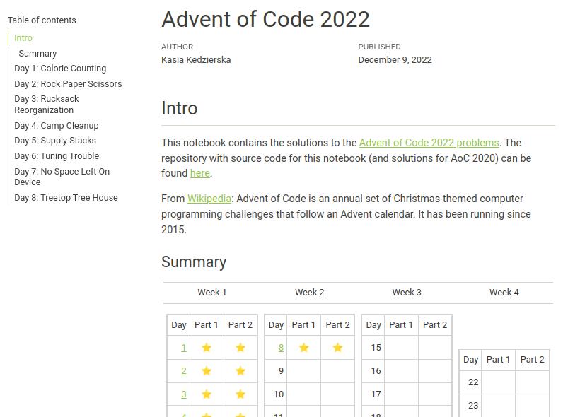

# My Advent of Code (AoC) solutions

```
         🎄                                      🎄
        /_\                                     /_\
       /___\                                   /___\
      /_____\                                 /_____\
     /_______\                               /_______\
    /_________\                             /_________\

    _      _             _          __    ___         _      
   /_\  __| |_ _____ _ _| |_   ___ / _|  / __|___  __| |___  
  / _ \/ _` \ V / -_) ' \  _| / _ \  _| | (__/ _ \/ _` / -_) 
 /_/ \_\__,_|\_/\___|_||_\__| \___/_|    \___\___/\__,_\___| 

         |||                                     |||
         |||                                     |||
     ~~~~~~~~~                               ~~~~~~~~~
         🎁                                         🎁

```

This repository contains my solutions to Advent of Code puzzles. I started solving them in [2020](#2020), and I'm continuing to do so in [2022](#2022), [2023](#2023), and [2024](#current-2024). So far, I didn't have time to solve all the puzzles in a given year, especially when work gets busy, puzzles get harder and it’s time to prepare for Christmas. Hoping this year will be different. 🤞

<details>
<summary> About Advent of Code </summary>

## About AoC

From the [subreddit Wiki](https://www.reddit.com/r/adventofcode/wiki/index):

> Advent of Code is a series of small programming puzzles for a variety of skill levels. They are self-contained and are just as appropriate for an expert who wants to stay sharp as they are for a beginner who is just learning to code. Each puzzle calls upon different skills and has two parts that build on a theme.

You can access the problems here: [adventofcode.com](https://adventofcode.com/). It will show you the most recent problems. If you want to access other year just type [adventofcode.com/2019](https://adventofcode.com/2019) for the year 2019.
</details>

## Current: 2024

For `AoC 2024` I will solve the problems in `Python` (and sometimes I'll add `Bash` solution). Each day's solution is linked to its rendered HTML output and notebook source.

For an overview of my journey and insights, check out my [blog post on AoC 2024](https://kasia.codes/posts/aoc24/). ✍️

| Day | Links                                                                                     |Part 1|Part 2|
|:--:|:------------------------------------------------------------------------------------------:|:----:|:----:|
|1 | [📄 HTML](http://kasia.codes/resources/aoc/2024/day_01) · [📓 Notebook](2024/day_01/notebook.ipynb) · [💻 Bash](2024/day_01/solution.sh)  |  ⭐  |  ⭐  |
|2 | [📄 HTML](http://kasia.codes/resources/aoc/2024/day_02) · [📓 Notebook](2024/day_02/notebook.ipynb)   |  ⭐  |  ⭐  |
|3 | [📄 HTML](http://kasia.codes/resources/aoc/2024/day_03) · [📓 Notebook](2024/day_03/notebook.ipynb) · [💻 Bash](2024/day_01/solution.sh)  |  ⭐  |  ⭐  |
|4 | [📄 HTML](http://kasia.codes/resources/aoc/2024/day_04) · [📓 Notebook](2024/day_04/notebook.ipynb)   |  ⭐  |  ⭐  |
|5 | [📄 HTML](http://kasia.codes/resources/aoc/2024/day_05) · [📓 Notebook](2024/day_05/notebook.ipynb)   |  ⭐  |  ⭐  |
|6 | 📄 HTML · [📓 Notebook [WIP]](2024/day_06/notebook.ipynb)   |  ⭐  |     |
|7 | 📄 HTML · [📓 Notebook [WIP]](2024/day_07/notebook.ipynb)   |  ⭐  |  ⭐  |

<details>
<summary> <h2 id="2023"> 2023 </h2> </summary>

For `AoC 2023` I am solving them in Python, in Jupyter notebooks (run in VS Code). I don't keep the inputs, as per the request of the creator of Advent of Code. I have GitHub Copilot running in VS Code, but only use it for autocompletion, the ideas for solutions and their implementation is mine. I also use GitHub Copilot for doc strings and minor improvements after I solve the tasks.

| Day | Part 1 | Part 2 |  | Day | Part 1 | Part 2 |  
| :-: | :----: | :----: | :-: | :-: | :----: | :----: |  
| [1](2023/Day01.ipynb) | ⭐ | ⭐ | | [8](2023/Day08.ipynb) | ⭐ | ⭐ |
| [2](2023/Day02.ipynb) | ⭐ | ⭐ | | [9](2023/Day09.ipynb) | ⭐ | ⭐ |
| [3](2023/Day03.ipynb) | ⭐ | ⭐ | | 10 | | |  
| [4](2023/Day04.ipynb) | ⭐ | ⭐ | | 11 | | |  
| [5](2023/Day05.ipynb) | ⭐ |    | | 12 | | |  
| [6](2023/Day06.ipynb) | ⭐ | ⭐ | | 13 | | |  
| [7](2023/Day07.ipynb) | ⭐ | ⭐ | | 14 | | |  

</details>

<details>
<summary> <h2 id="2022"> 2022 </h2> </summary>

For `AoC 2022` I decided to solve the problems by writing up my solutions in Quarto Publication (so far using `Python`). You can look up the answers in the online version of the notebook [here](https://kzkedzierska.quarto.pub/advent-of-code-2022/).

[](https://kzkedzierska.quarto.pub/advent-of-code-2022/)

[](https://github.com/kzkedzierska/aoc/actions/workflows/publish.yml)

</details>

<details>
<summary> <h2 id="2020"> 2020 </h2> </summary>

In 2020, I solved `AOC 2020` challenges using `R` with solutions organised and split into subdirectories, you can check them out [here](/2020).

</details>
